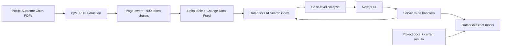

# Legal Retrieval Explorer

A public-facing research application for semantic, lexical, and hybrid retrieval over a focused corpus of U.S. Supreme Court opinions. It connects case-first search to a documentation-grounded technical guide so a user can find a precedent and inspect why the retrieval system behaved as it did.

> Legal retrieval research prototype. Public U.S. Supreme Court opinions only. Not legal advice.

## Why this project

Legal search is both an information-retrieval problem and an evaluation problem. Long opinions create many more candidate chunks than short ones, exact doctrine can reward lexical matching, and client-style fact patterns often reward semantic matching. This project makes those tradeoffs visible rather than hiding them behind a generated answer.



## Search strategies

- **Semantic (ANN):** conceptual meaning and paraphrased fact patterns.
- **Full text:** exact phrases, statutory terms, and doctrinal vocabulary.
- **Hybrid:** Databricks combines semantic and lexical ranked lists with Reciprocal Rank Fusion. Ranks—not raw cross-method scores—are compared.

The server requests 20 chunks and collapses them by `case_id`. Each case receives one rank based on its best passage; other matching passages remain inspectable. This prevents a 101-chunk opinion from crowding out shorter cases.

## Corpus and evaluation

The reproducible Python pipeline prepares 8 public opinions: 350 pages, approximately 693,422 extracted characters, and 234 chunks. The controlled 18-query benchmark mixes semantic fact patterns, exact terminology, causation, third-party retaliation, and broad recall.

| Method | Recall@1 | Recall@3 | Recall@5 | MRR |
|---|---:|---:|---:|---:|
| ANN | 0.8889 | 0.9444 | 1.0000 | 0.9278 |
| FULL_TEXT | 0.7778 | 0.9444 | 0.9444 | 0.8598 |
| HYBRID | 0.8889 | 1.0000 | 1.0000 | 0.9259 |

These figures apply only to this prototype benchmark. Hybrid did not dramatically improve average rank over ANN; it eliminated the top-three miss, retrieving 18/18 primary cases within the top three. Q17 showed semantic strength on an unnamed third-party-retaliation relationship (ANN rank 1, FULL_TEXT rank 7). Q18 showed that an underspecified prompt can legitimately map to several precedents.

## Technical stack

Next.js App Router, React, TypeScript, server route handlers, Databricks AI Search REST API, Databricks Model Serving, Delta Lake/Unity Catalog, Python, PyMuPDF, PyArrow, and Vitest. The live index is a client dependency; this repository does not recreate or modify it.

## Run locally

```bash
npm install
cp .env.example .env.local
# Leave MOCK_DATABRICKS=true for a credential-free demonstration.
npm run dev
```

Validation commands:

```bash
npm run lint
npm run typecheck
npm test
npm run build
make validate
```

## Databricks configuration

All variables are server-only:

```text
DATABRICKS_HOST=https://your-workspace.cloud.databricks.com
DATABRICKS_TOKEN=...
DATABRICKS_INDEX_NAME=workspace.default.legal_chunks_index
DATABRICKS_CHAT_MODEL=your-serving-endpoint-name
MOCK_DATABRICKS=false
```

The search adapter calls the existing index with `ANN`, `FULL_TEXT`, or `HYBRID`. The chat model is deliberately configurable because serving-endpoint availability differs by workspace. If chat is not configured, search continues to work and the guide shows a configuration message.

## Vercel deployment

1. Push this repository to GitHub and import it in Vercel from the repository root.
2. Use the detected Next.js framework settings and standard `npm run build` command.
3. Add the five variables above in Vercel Project Settings → Environment Variables. Use a short-lived production credential and set `MOCK_DATABRICKS=false`.
4. Deploy, verify `/api/health`, run all three retrieval modes, and test the guide. Visitors need no Databricks account.

No deployment is performed by this repository, and secrets must never be placed in source control.

## Security and limitations

Credentials and context assembly stay on the server. APIs cap query length, message length/count, result count, and request duration. Public errors omit credentials and stack traces; prompts and chat history are not persisted; the guide has no tools or arbitrary execution. A production system still needs OAuth/service-principal authentication, rate limiting, auditability, monitoring, and retention policy.

The corpus is intentionally tiny, relevance judgments are author-created, the benchmark has 18 queries, and no general legal accuracy is established. Databricks reranking could not be tested because it was not enabled in the workspace; no reranker results are claimed. See [`docs/`](docs/) for the technical deep dive, evaluation details, and future work.

## Repository structure

`src/app` contains the UI and server endpoints; `src/lib` contains Databricks, ranking, and context abstractions; `tests` covers parsing, collapse, ordering, context modes, and validation; `scripts` and `data` preserve the corpus/evaluation pipeline; `docs` supplies human and chatbot technical context.
