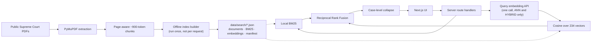

# Legal Retrieval Explorer

A public-facing research application for semantic, lexical, and hybrid retrieval over a focused
corpus of U.S. Supreme Court opinions. It connects case-first search to a documentation-grounded
technical guide so a user can find a precedent and inspect why the retrieval system behaved as it
did.

> Legal retrieval research prototype. Public U.S. Supreme Court opinions only. Not legal advice.

## Why this project

Legal search is both an information-retrieval problem and an evaluation problem. Long opinions
create many more candidate chunks than short ones, exact doctrine can reward lexical matching, and
client-style fact patterns often reward semantic matching. This project makes those tradeoffs
visible rather than hiding them behind a generated answer.



## Architecture: two phases

**Phase 1** built the corpus as a Delta table with Change Data Feed and indexed it in Databricks
AI Search using `databricks-gte-large-en` embeddings. That was the fastest way to establish ANN,
lexical, and hybrid baselines on managed infrastructure and to run a controlled 18-query
benchmark, with no retrieval code to write or defend.

**Phase 2** moved retrieval into the application. Because the public demonstration corpus contains
only 234 chunks, maintaining a continuously provisioned search endpoint was economically
unnecessary: AI Search bills for provisioned serving time whether or not anyone queries it, and a
linear scan over 234 pre-embedded vectors is a sub-millisecond loop. The production demo therefore
uses precomputed embeddings, local BM25, local vector similarity, and Reciprocal Rank Fusion,
preserving the retrieval experiment while reducing idle infrastructure cost to effectively zero.

This is an engineering decision about matching infrastructure to corpus size, not a verdict on
managed vector search. At a million documents the conclusion reverses, and Phase 1's architecture
becomes the right answer again.

There is no vector database, no always-on search service, no background compute, and no database.
The live site requires no Databricks credentials.

## Search strategies

- **Semantic (ANN)** — embedding similarity. One embedding request for the query, then cosine
  similarity against all 234 precomputed corpus vectors.
- **Full text** — BM25 (`k1 = 1.2`, `b = 0.75`) over a precomputed index. Makes no network call
  and works with no API key at all.
- **Hybrid** — both rankings fused with Reciprocal Rank Fusion (`k = 60`, candidate depth 30).
  Ranks are fused, never raw scores: BM25 scores are unbounded and cosine scores live in [-1, 1].

The server requests 20 chunks and collapses them by `case_id`. Each case receives one rank based
on its best passage; other matching passages remain inspectable. This deduplicates the display so
a 101-chunk opinion such as *Bostock* cannot occupy several visible ranks at once. It does not
diversify the candidate set: collapse runs after retrieval, so a long opinion can still consume
most of the 20 chunks and push a shorter case out of the candidates entirely.

## Corpus and evaluation

The reproducible Python pipeline prepares 8 public opinions: 350 pages, approximately 693,422
extracted characters, and 234 chunks. The controlled 18-query benchmark mixes semantic fact
patterns, exact terminology, causation, third-party retaliation, and broad recall.

| Method | Recall@1 | Recall@3 | Recall@5 | MRR |
|---|---:|---:|---:|---:|
| ANN | 0.8333 | 0.9444 | 1.0000 | 0.8907 |
| FULL_TEXT | 0.8889 | 0.9444 | 0.9444 | 0.9153 |
| HYBRID | 0.9444 | 0.9444 | 0.9444 | 0.9537 |

Phase 1 baseline, for comparison:

| Method | Recall@1 | Recall@3 | Recall@5 | MRR |
|---|---:|---:|---:|---:|
| ANN | 0.8889 | 0.9444 | 1.0000 | 0.9278 |
| FULL_TEXT | 0.7778 | 0.9444 | 0.9444 | 0.8598 |
| HYBRID | 0.8889 | 1.0000 | 1.0000 | 0.9259 |

The migration was a trade. Lexical retrieval improved clearly (Recall@1 0.7778 → 0.8889). Hybrid
became sharper at rank one and now leads on MRR, but lost the perfect top-three coverage the
Databricks hybrid had. Semantic retrieval regressed slightly at rank one. Sixteen of the eighteen
queries are answered at rank one by every method, so the entire comparison rests on Q17, Q18, and
small MRR differences — which is a statement about the benchmark's remaining resolution as much as
about the engines.

These figures apply only to this prototype benchmark and establish no general legal-search
accuracy. See [`docs/LOCAL_RETRIEVAL_EVALUATION.md`](docs/LOCAL_RETRIEVAL_EVALUATION.md) for the
embedding dimension tradeoff, the BM25 parameter sweep, the 100-cell RRF grid, and the Q17/Q18
analysis.

### Reproducing the benchmark

Unlike the Phase 1 table, whose raw rankings were never preserved, the current numbers ship with
their evidence in `data/evaluation/local_retrieval_results.json`.

```bash
npm run benchmark
.venv/bin/python scripts/evaluate_retrieval.py --score data/evaluation/local_retrieval_results.json
```

The second command uses the original Databricks-era scorer, unmodified, and reproduces the
primary-gold table independently. Running the benchmark makes 18 query embedding requests and
costs well under a cent.

## Technical stack

Next.js App Router, React, TypeScript, server route handlers, OpenAI embeddings and chat
completions behind small provider interfaces, Python, PyMuPDF, PyArrow, and Vitest. Phase 1's
Databricks AI Search, Databricks Model Serving, and Delta Lake/Unity Catalog components are no
longer required to run the application.

## Run locally

```bash
npm install
cp .env.example .env.local   # add OPENAI_API_KEY, or set MOCK_SEARCH=true
npm run dev
```

Full-text search works immediately with no API key, because the index artifacts are committed.
Semantic and hybrid search additionally need `OPENAI_API_KEY`. For credential-free frontend work,
set `MOCK_SEARCH=true`; mock results are labelled inline so they cannot be mistaken for real ones.

The `dev` and `build` scripts deliberately use Next's WASM SWC package. On this Dropbox-hosted
macOS workspace the native SWC binary fails code-signature validation; removing the fallback makes
`next build` fail. Re-test the native compiler before removing these environment flags on a
different filesystem or build host.

Validation commands:

```bash
npm run lint
npm run typecheck
npm test
npm run build
make validate
```

### Rebuilding the search index

The four artifacts in `data/search/` are committed, so this is only needed when the corpus,
tokenizer, BM25 configuration, or embedding model changes.

```bash
npm run build:index                 # reuses committed vectors when nothing relevant changed
npm run build:index -- --force      # re-embed all 234 chunks (~$0.03)
npm run build:index -- --skip-embeddings   # rebuild lexical artifacts only, no API key needed
```

The builder is idempotent: identical input produces byte-identical BM25 and document artifacts,
and vectors are reused unless the corpus, model, or dimensions changed. It requires the chunk CSV,
which is not stored in Git — see below.

Useful options: `--model`, `--dimensions`, `--fold-suffixes`, `--k1`, `--b`, `--out`. Building an
alternate index into a scratch directory and scoring it with
`npm run benchmark -- --index <dir>` is how the configuration tables in the evaluation doc were
produced.

### Rebuild the public corpus from a fresh clone

The PDFs, extracted text, and generated chunk files are intentionally not stored in Git. Their
public source URLs and expected SHA-256 hashes are tracked. To create the Python environment,
download and verify the eight opinions, extract them, generate chunks, and run both validators:

```bash
make bootstrap
make test-python
```

Individual stages are available as `make setup`, `make tokenizer`, `make fetch`, `make prepare`,
`make chunks`, and `make validate`. `make tokenizer` is a one-time preflight: tiktoken ships no
encoding data and downloads its `cl100k_base` BPE asset on first use, so chunking and chunk
validation are not offline operations on a cold cache. Set `TIKTOKEN_CACHE_DIR` to reuse an
existing cache. `make fetch` performs network downloads from the public URLs in
`data/metadata/metadata.csv`; review those URLs before running it. A changed upstream PDF fails
hash verification instead of silently changing the benchmark.

## Configuration

All variables are server-only. No secret is ever exposed to browser code and none is prefixed
`NEXT_PUBLIC_`.

```text
SEARCH_BACKEND=local
OPENAI_API_KEY=...
OPENAI_EMBEDDING_MODEL=text-embedding-3-large
OPENAI_EMBEDDING_DIMENSIONS=1024
OPENAI_CHAT_MODEL=gpt-5-mini
```

The embedding model and dimensions must match `data/search/index_manifest.json`. They are compared
at query time and a mismatch is refused rather than served as a silently wrong ranking.
`text-embedding-3-small` at 512 dimensions was measured first; it cost 5.6 points of hybrid
Recall@1 and failed to retrieve *Thompson* on Q17 at all, so it was rejected on evidence.
`gpt-5-nano` is a valid lower-cost alternative for `OPENAI_CHAT_MODEL`.

`SEARCH_BACKEND=databricks` selects the retained Phase 1 adapter for comparison runs and needs
`DATABRICKS_HOST`, `DATABRICKS_TOKEN`, and `DATABRICKS_INDEX_NAME`. Production must not set it.

### Cost behaviour

| Event | Paid calls |
|---|---|
| Site idle | **none** — no provisioned service of any kind |
| Full-text search | none |
| Semantic or hybrid search | 1 embedding request (~50 tokens, ~$0.000007) |
| Technical guide question | 1 chat request (~750–5,900 input tokens, up to 3,200 output) |
| Research summary | 1 embedding + 1 chat request (~3,800 input, up to 4,000 output) |
| Rebuilding the index | ~207,000 embedding tokens, roughly $0.03, once |

Searching never invokes a language model. The research summary is a separate endpoint behind an
explicit button, so a legal query reaches an LLM only when a visitor asks it to.

The output-token caps are sized above a measured cliff rather than guessed. `gpt-5-mini` spends
`max_completion_tokens` on reasoning tokens *before* emitting any visible text, so a cap that
looks generous for the answer can be consumed entirely by reasoning and return a well-formed
response with empty content. At 2,000 tokens the summary prompt produced 2,000 reasoning tokens
and no output; at 3,000 reasoning fell to 256 and it produced ~9,500 characters. Both routes
declare `maxDuration = 60` and time out below it, because a detailed answer runs 20–35 seconds.

## Vercel deployment

1. Push this repository to GitHub and import it in Vercel from the repository root.
2. Use the detected Next.js framework settings and standard `npm run build` command.
3. Add the variables above in Project Settings → Environment Variables.
4. Deploy, verify `/api/health`, run all three retrieval modes, and test the guide.

`/api/health` loads and cross-validates the complete artifact set — not the manifest alone — and
reports the backend, whether the index is usable, whether embedding and chat credentials are
present, and the row count, embedding model, and build time of the index that actually shipped.
Any artifact that is missing, malformed, or built from a different corpus produces 503 and an
`indexError` naming the fault, so a deployment that cannot serve search fails the check rather
than reporting `ok`. The load is cached per warm instance, so polling costs one parse per
instance rather than one per request.

The index artifacts are pulled into the serverless function bundles by
`outputFileTracingIncludes` in `next.config.ts`, so a function cannot ship without its own corpus.

### Smoke check

`/api/cron/search-check` runs one probe per retrieval method and returns 503 if any fails. It is
**no longer on a schedule**: under local retrieval there is no external service whose availability
could drift, and a daily run would be exactly the kind of background paid call this architecture
exists to remove. It is kept as an authenticated on-demand check because methods still fail
independently — full text needs only the committed artifacts, while semantic and hybrid
additionally need the embedding API. It requires `CRON_SECRET` and fails closed without it, so an
unauthenticated caller cannot trigger paid embedding calls.

## Security and limitations

Credentials and context assembly stay on the server. Query length, question length, result count,
passage count, output-token budgets, and request durations are capped in a single module, because
a bound that exists only in a prompt string or a UI attribute is a bound a direct API caller does
not have to respect. The guide endpoint accepts a single question rather than a caller-supplied
transcript, so assistant turns cannot be forged, and retrieval state reaches the model as
schema-validated, delimited untrusted data rather than as instructions. The research summary
re-runs retrieval server-side rather than trusting passages posted back by the browser. Public
errors omit credentials and stack traces, API keys are never logged, malformed request bodies are
rejected as client errors, prompts and chat history are not persisted, and the guide has no tools
or arbitrary execution. Production never falls back to mock data: a failed embedding call surfaces
as a configuration or service error, not as a plausible-looking fake ranking.

The corpus is intentionally tiny, relevance judgments are author-created, the benchmark has 18
queries, and no general legal accuracy is established. Sixteen of those queries are solved at rank
one by all three methods, so the benchmark has little remaining power to distinguish between good
retrieval systems. Databricks reranking could not be tested in Phase 1 because it was not enabled
in the workspace; no reranker results are claimed. See [`docs/`](docs/) for the technical deep
dive, evaluation details, and future work.

### Rate limiting

Two of the four API routes reach paid provider APIs, so an unthrottled caller is a cost risk
rather than only a theoretical one. Rate limiting is enforced by a Vercel WAF rule rather than in
application code:

| Setting | Value |
|---|---|
| Match | `Request Path` starts with `/api/` |
| Algorithm | Fixed window |
| Window | 60s |
| Limit | 20 requests |
| Counting key | IP address |
| Action | Deny (403) |

The rule runs at the edge, so a rejected request never invokes a function and never reaches a
paid API — an in-process limiter would already have paid for the invocation, and would not share
counters across serverless instances. Static pages are unaffected because only `/api/` paths
match.

Vercel's deny action answers 403 with an HTML body rather than this application's JSON error
shape, so the browser client checks the response status before parsing. Parsing first would make
`response.json()` throw and render the parser's own message ("Unexpected token '<'…") to the
visitor in place of the error; denied requests now surface as *"Too many requests. Please wait a
moment and try again."*

Three limits are worth recording. Counters are tracked per region, so traffic arriving in several
regions can exceed the configured limit in aggregate. The Hobby plan allows one rate-limit rule
per project, so search, chat, and summarize share a single policy despite their costs differing
by three orders of magnitude; full-text search, which is free, is throttled by the same rule as
summarization, which is not. And the limit bounds exposure without making it small: a single IP
staying just inside 20 requests/minute against `/api/summarize` is roughly $258/day. A hard spend
cap on the provider account is the only control that survives the per-region gap, and is the more
important of the two.

## Repository structure

`src/app` contains the UI and server endpoints; `src/lib/search` contains the tokenizer, BM25,
vector similarity, rank fusion, artifact validation, and case collapse; `src/lib/embeddings` and
`src/lib/llm` hold the provider abstractions; `src/lib/databricks` retains the Phase 1 comparison
adapter. `scripts` holds the corpus pipeline, the offline index builder, and both evaluation
harnesses; `data/search` holds the committed retrieval artifacts; `tests` covers the tokenizer,
BM25, similarity, fusion, collapse, artifact corruption, validation, provider failures, and
grounding inputs; `docs` supplies human and chatbot technical context.
