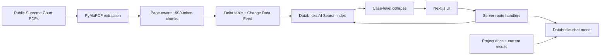

# Legal Retrieval Explorer

A public-facing research application for semantic, lexical, and hybrid retrieval over a focused corpus of U.S. Supreme Court opinions. It connects case-first search to a documentation-grounded technical guide so a user can find a precedent and inspect why the retrieval system behaved as it did.

> Legal retrieval research prototype. Public U.S. Supreme Court opinions only. Not legal advice.

## Why this project

Legal search is both an information-retrieval problem and an evaluation problem. Long opinions create many more candidate chunks than short ones, exact doctrine can reward lexical matching, and client-style fact patterns often reward semantic matching. This project makes those tradeoffs visible rather than hiding them behind a generated answer.



## Search strategies

- **Semantic (ANN):** conceptual meaning and paraphrased fact patterns.
- **Full text:** exact phrases, statutory terms, and doctrinal vocabulary.
- **Hybrid:** Databricks combines semantic and lexical ranked lists with Reciprocal Rank Fusion. Ranks—not raw cross-method scores—are compared.

The server requests 20 chunks and collapses them by `case_id`. Each case receives one rank based on its best passage; other matching passages remain inspectable. This deduplicates the display so a 101-chunk opinion such as *Bostock* cannot occupy several visible ranks at once. It does not diversify the candidate set: collapse runs after retrieval, so a long opinion can still consume most of the 20 chunks and push a shorter case out of the candidates entirely, where no post-processing can recover it. Candidate-level diversification would need deeper retrieval, case-aware selection, two-stage retrieval, or reranking before collapse.

## Corpus and evaluation

The reproducible Python pipeline prepares 8 public opinions: 350 pages, approximately 693,422 extracted characters, and 234 chunks. The controlled 18-query benchmark mixes semantic fact patterns, exact terminology, causation, third-party retaliation, and broad recall.

| Method | Recall@1 | Recall@3 | Recall@5 | MRR |
|---|---:|---:|---:|---:|
| ANN | 0.8889 | 0.9444 | 1.0000 | 0.9278 |
| FULL_TEXT | 0.7778 | 0.9444 | 0.9444 | 0.8598 |
| HYBRID | 0.8889 | 1.0000 | 1.0000 | 0.9259 |

These figures apply only to this prototype benchmark. Hybrid did not dramatically improve average rank over ANN; it eliminated the top-three miss, retrieving 18/18 primary cases within the top three. Q17 showed semantic strength on an unnamed third-party-retaliation relationship (ANN rank 1, FULL_TEXT rank 7). Q18 showed that an underspecified prompt can legitimately map to several precedents.

The table above records the original workspace run; its raw rankings were not preserved. For new auditable runs, configure the three Databricks search variables and run:

```bash
.venv/bin/python scripts/evaluate_retrieval.py --output data/evaluation/retrieval_results.json
.venv/bin/python scripts/evaluate_retrieval.py --score data/evaluation/retrieval_results.json
```

The result file records every query's case ranking, index name, run time, and retrieval depth so the displayed metrics can be recomputed rather than transcribed manually. Commit a result file when publishing new benchmark claims; it contains queries and case IDs but no credential.

## Technical stack

Next.js App Router, React, TypeScript, server route handlers, Databricks AI Search REST API, Databricks Model Serving, Delta Lake/Unity Catalog, Python, PyMuPDF, PyArrow, and Vitest. The live index is a client dependency; this repository does not recreate or modify it.

## Run locally

```bash
npm install
cp .env.example .env.local
# Leave MOCK_DATABRICKS=true for a credential-free demonstration.
npm run dev
```

The `dev` and `build` scripts deliberately use Next's WASM SWC package. On this Dropbox-hosted macOS workspace the native SWC binary fails code-signature validation; removing the fallback makes `next build` fail. Re-test the native compiler before removing these environment flags on a different filesystem or build host.

Validation commands:

```bash
npm run lint
npm run typecheck
npm test
npm run build
make validate
```

### Rebuild the public corpus from a fresh clone

The PDFs, extracted text, and generated chunk files are intentionally not stored in Git. Their public source URLs and expected SHA-256 hashes are tracked. To create the Python environment, download and verify the eight opinions, extract them, generate chunks, and run both validators:

```bash
make bootstrap
make test-python
```

Individual stages are available as `make setup`, `make tokenizer`, `make fetch`, `make prepare`, `make chunks`, and `make validate`. `make tokenizer` is a one-time preflight: tiktoken ships no encoding data and downloads its `cl100k_base` BPE asset from `openaipublic.blob.core.windows.net` on first use, so chunking and chunk validation are not offline operations on a cold cache. `make bootstrap` runs it for you, and a failed download now reports what is missing instead of a urllib stack trace. Set `TIKTOKEN_CACHE_DIR` to reuse an existing cache. `make fetch` performs network downloads from the public URLs in `data/metadata/metadata.csv`; review those URLs before running it. A changed upstream PDF fails hash verification instead of silently changing the benchmark.

## Databricks configuration

All variables are server-only:

```text
DATABRICKS_HOST=https://your-workspace.cloud.databricks.com
DATABRICKS_TOKEN=...
DATABRICKS_INDEX_NAME=workspace.default.legal_chunks_index
DATABRICKS_CHAT_MODEL=your-serving-endpoint-name
MOCK_DATABRICKS=false
```

The search adapter calls the existing index with `ANN`, `FULL_TEXT`, or `HYBRID`. The chat model is deliberately configurable because serving-endpoint availability differs by workspace. If chat is not configured, search continues to work and the guide shows a configuration message.

`FULL_TEXT` additionally requires the **AI Search: Full-Text Search** preview to be enabled in the Databricks workspace (Settings → Previews). It is a beta feature and off by default. While it is off, Databricks rejects only full-text queries with HTTP 400 while `ANN` and `HYBRID` keep serving normally from the same endpoint, so the failure looks like an application bug rather than a missing entitlement. The public error message deliberately withholds the Databricks diagnostic; the `error_code` is in the server log line `[databricks-search] request failed`. Reranking is gated the same way and was unavailable in the original workspace, which is why no reranker results are claimed.

## Vercel deployment

1. Push this repository to GitHub and import it in Vercel from the repository root.
2. Use the detected Next.js framework settings and standard `npm run build` command.
3. Add the variables above in Vercel Project Settings → Environment Variables, including `CRON_SECRET`. Use a short-lived production credential and set `MOCK_DATABRICKS=false`.
4. Deploy, verify `/api/health`, run all three retrieval modes, and test the guide. Visitors need no Databricks account.

No deployment is performed by this repository, and secrets must never be placed in source control.

### Daily search monitor

`vercel.json` schedules `/api/cron/search-check` once a day. The route runs one probe per retrieval method in parallel, treats an empty result set as a fault, and logs a line per method:

```text
[search-monitor] ok      { method: 'ANN', cases: 3, ms: 412, mode: 'live' }
[search-monitor] FAILED  { method: 'FULL_TEXT', status: 400, error: '…', mode: 'live' }
```

A failed probe returns 503 so the run is marked failed in Vercel's cron history, which surfaces an outage without reading logs. This exists because a single method can break while the others keep working — full-text search is gated behind a workspace preview flag, and when that flag is off Databricks rejects only `FULL_TEXT`.

The route requires `CRON_SECRET` and fails closed without it: it compares `Authorization: Bearer $CRON_SECRET`, so an unauthenticated caller cannot trigger live Databricks queries. Generate one with `openssl rand -base64 32`. Hobby projects are limited to daily schedules.

## Security and limitations

Credentials and context assembly stay on the server. APIs cap query length, question length, result count, and request duration. The guide endpoint accepts a single question rather than a caller-supplied transcript, so assistant turns cannot be forged, and retrieval state reaches the model as schema-validated, delimited untrusted data rather than as instructions. Public errors omit credentials and stack traces, malformed request bodies are rejected as client errors, prompts and chat history are not persisted, and the guide has no tools or arbitrary execution. Request frequency is limited outside the application, at the edge (see below). A production system still needs OAuth/service-principal authentication, auditability, and retention policy.

The corpus is intentionally tiny, relevance judgments are author-created, the benchmark has 18 queries, and no general legal accuracy is established. Databricks reranking could not be tested because it was not enabled in the workspace; no reranker results are claimed. See [`docs/`](docs/) for the technical deep dive, evaluation details, and future work.

### Rate limiting

Both API routes reach credentialed Databricks services, so an unthrottled caller is a cost and availability risk rather than only a theoretical one. Rate limiting is enforced by a Vercel WAF rule rather than in application code:

| Setting | Value |
|---|---|
| Match | `Request Path` starts with `/api/` |
| Algorithm | Fixed window |
| Window | 60s |
| Limit | 20 requests |
| Counting key | IP address |
| Action | Log, pending a switch to Deny (429) once real traffic is observed |

The rule runs at the edge, so a rejected request never invokes a function and never reaches Databricks — an in-process limiter would already have paid for the invocation, and would not share counters across serverless instances. The static pages are unaffected because only `/api/` paths match.

Two limits are worth recording. Counters are tracked per region, so traffic arriving in several regions can exceed the configured limit in aggregate. And the Hobby plan allows one rate-limit rule per project, so search and chat share a single policy despite chat being the more expensive endpoint; separate policies would need a plan that permits more rules.

## Repository structure

`src/app` contains the UI, server endpoints, and the daily retrieval monitor under `api/cron`; `src/lib` contains Databricks, ranking, and context abstractions; `tests` covers parsing, collapse, ordering, context modes, validation, and monitor probes; `scripts` and `data` preserve the corpus/evaluation pipeline; `docs` supplies human and chatbot technical context.
